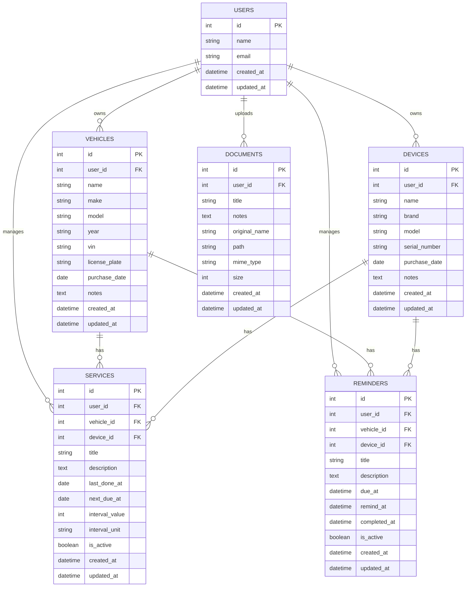

# AllReminderV3

AllReminderV3 to nowoczesna aplikacja webowa typu **full-stack (SPA + REST API)**, stworzona w ramach przedmiotu **ZTPAI**.  
Aplikacja umożliwia użytkownikowi kompleksowe zarządzanie:
- pojazdami,
- urządzeniami,
- dokumentami,
- serwisami,
- przypomnieniami.

Projekt został wykonany samodzielnie i spełnia komplet wymagań projektowych określonych przez prowadzącego.

---

## 1. Cel projektu

Celem projektu było zaprojektowanie i zaimplementowanie kompletnej aplikacji webowej:
- z wyraźnym podziałem na backend i frontend,
- z poprawnie zaprojektowaną bazą danych w 3 postaci normalnej (3NF),
- z mechanizmem uwierzytelniania i autoryzacji użytkowników,
- z komunikacją frontend–backend poprzez REST API,
- z nowoczesnym i responsywnym interfejsem użytkownika,
- z czytelną i logiczną historią repozytorium Git.

Projekt odwzorowuje realny system do zarządzania danymi użytkownika w kontekście pojazdów, urządzeń, dokumentów oraz terminów serwisowych.

---

## 2. Architektura aplikacji

Aplikacja została zaprojektowana w architekturze **SPA + REST API**.

### Backend
Backend odpowiada za:
- udostępnianie REST API,
- realizację logiki biznesowej,
- walidację danych wejściowych,
- zarządzanie bazą danych,
- uwierzytelnianie i autoryzację użytkowników.

### Frontend
Frontend to aplikacja typu **Single Page Application**, która:
- komunikuje się wyłącznie z API,
- nie ma bezpośredniego dostępu do bazy danych,
- zarządza routingiem i stanem aplikacji,
- prezentuje dane użytkownikowi w postaci widoków i formularzy.

Komunikacja odbywa się w formacie **JSON over HTTP**.

---

## 3. Zastosowane technologie

### Backend
- Laravel 12
- PHP 8.2+
- Laravel Sanctum (Bearer Token)
- Eloquent ORM
- SQLite
- REST API

### Frontend
- Vue 3 (Composition API)
- Vite
- Tailwind CSS
- Axios
- Vue Router

### Uzasadnienie doboru technologii
Laravel zapewnia szybkie tworzenie bezpiecznego API oraz czytelną architekturę backendu.  
Vue 3 z Composition API umożliwia modularną i skalowalną logikę frontendową.  
Tailwind CSS pozwala na spójny, nowoczesny i responsywny interfejs użytkownika.  
SQLite upraszcza konfigurację środowiska lokalnego.

---

## 4. Baza danych

Baza danych została zaprojektowana zgodnie z zasadami **3NF (Third Normal Form)**:
- brak redundancji danych,
- jednoznaczne relacje pomiędzy encjami,
- logiczny podział odpowiedzialności tabel.

W bazie danych znajduje się minimum **30 rekordów testowych**.

### Tabele:
- users
- vehicles
- devices
- documents
- reminders
- services

---

## 5. Diagram ERD

Diagram ERD odzwierciedla rzeczywistą strukturę bazy danych zaimplementowaną w projekcie.



## 6. Uwierzytelnianie i autoryzacja

Aplikacja wykorzystuje **tokenowe uwierzytelnianie Bearer Token** oparte o **Laravel Sanctum**.

Zaimplementowano:
- rejestrację użytkownika,
- logowanie użytkownika,
- generowanie tokenów dostępu,
- przechowywanie tokenu po stronie frontendu,
- automatyczne przywracanie sesji po odświeżeniu strony,
- ochronę tras wymagających zalogowania,
- wylogowanie użytkownika.

---

## 7. REST API

Backend udostępnia REST API zgodne z zasadami REST.

Przykładowe endpointy:
- POST /api/login
- POST /api/register
- POST /api/logout
- GET /api/me
- GET /api/vehicles
- POST /api/vehicles
- GET /api/vehicles/{id}
- GET /api/devices
- POST /api/devices
- POST /api/documents/upload
- POST /api/services
- POST /api/reminders

---

## 8. Frontend i interfejs użytkownika

Frontend został zrealizowany jako **Single Page Application**.

Zaimplementowane funkcjonalności:
- dashboard z podsumowaniem danych,
- lista i szczegóły pojazdów,
- lista i szczegóły urządzeń,
- upload i lista dokumentów,
- formularze dodawania danych,
- nawigacja i routing,
- obsługa stanów loading i błędów.

---

## 9. Repozytorium Git

Projekt zarządzany jest przy użyciu systemu Git.

Repozytorium:
https://github.com/jK799/AllReminderV3

---

## 10. Uruchomienie projektu

### Backend
composer install  
cp .env.example .env  
php artisan key:generate  
php artisan migrate  
php artisan serve  

Backend: http://localhost:8000

### Frontend
npm install  
npm run dev  

Frontend: http://localhost:5173

---

## 11. Struktura projektu

Poniżej przedstawiono uproszczoną strukturę katalogów i plików istotnych dla projektu (backend + frontend):

```text
AllReminderV3/
├─ app/
│  ├─ Http/
│  │  ├─ Controllers/
│  │  │  └─ Api/                 # Kontrolery REST API (np. auth, vehicles, devices, documents)
│  │  ├─ Middleware/             # Middleware (np. auth, CORS, itp.)
│  │  └─ Requests/               # FormRequest (walidacja żądań)
│  └─ Models/                    # Modele Eloquent (User, Vehicle, Device, Document, Service, Reminder)
│
├─ bootstrap/                    # Bootstrap aplikacji Laravel
├─ config/                       # Konfiguracja aplikacji
│
├─ database/
│  ├─ migrations/                # Migracje schematu bazy danych
│  ├─ seeders/                   # Seedery (opcjonalnie)
│  └─ database.sqlite            # Lokalna baza SQLite (jeśli commitowana w repo)
│
├─ public/                       # Publiczny katalog aplikacji (wejściowy index.php)
├─ resources/
│  ├─ css/                       # Style (Tailwind entry)
│  ├─ js/
│  │  ├─ components/             # Komponenty UI (np. AppLayout)
│  │  ├─ composables/            # Logika współdzielona (np. useAuth)
│  │  ├─ services/               # Warstwa komunikacji z API (axios, helpery)
│  │  ├─ views/                  # Widoki stron (Dashboard, Vehicles, Devices, Documents, Upload itd.)
│  │  ├─ router.js               # Konfiguracja Vue Router + guardy
│  │  └─ app.js                  # Punkt startowy frontendu (Vite)
│  └─ views/                     # Widoki Blade (głównie layout startowy dla SPA)
│
├─ routes/
│  ├─ api.php                    # Trasy API (REST, auth:sanctum)
│  └─ web.php                    # Trasy web (start SPA, fallback)
│
├─ storage/
│  ├─ app/                       # Pliki aplikacji (np. uploady dokumentów)
│  └─ logs/                      # Logi aplikacji
│
├─ tests/                        # Testy (opcjonalnie; mogą zostać rozwinięte później)
├─ .env.example                  # Przykładowa konfiguracja środowiska
├─ composer.json                 # Zależności PHP (Laravel)
├─ package.json                  # Zależności JS (Vue/Vite/Tailwind)
├─ vite.config.js                # Konfiguracja Vite
└─ README.md                     # Dokumentacja projektu
```

---

## 12. Autor

Autor: Jakub Hruby